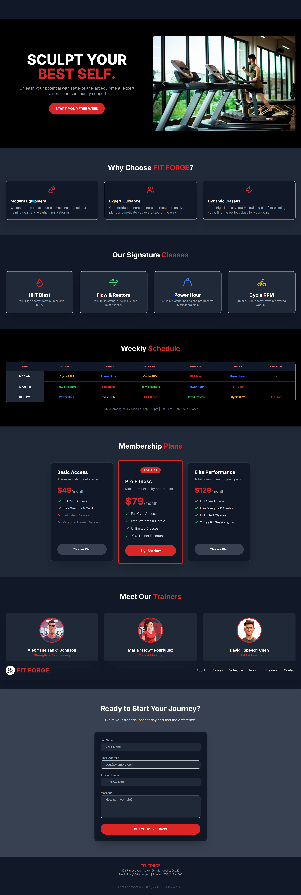
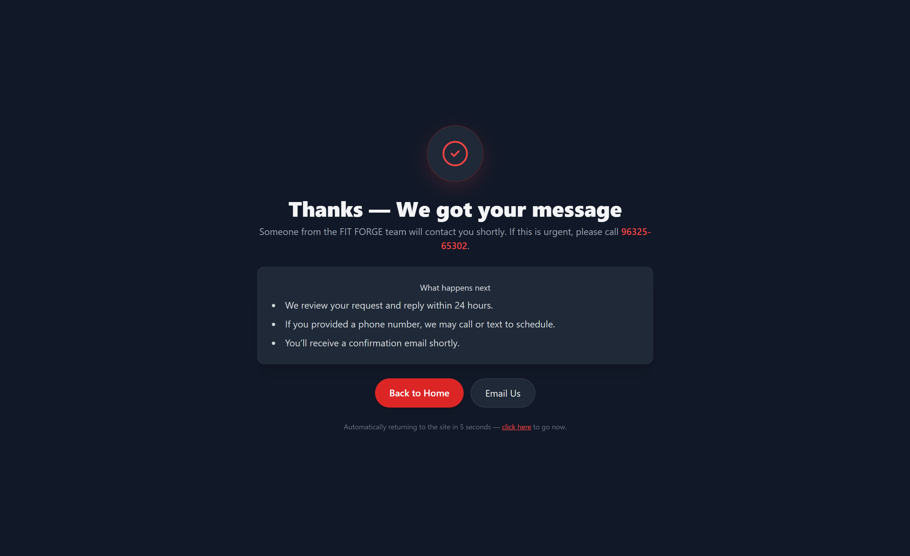

# FIT FORGE 💪

A modern fitness and gym business website built with responsive design principles and smooth user experience.

## 🌐 Live Demo

👉 https://fitforge-site.netlify.app/

---

## 📌 Features

- Modern responsive UI
- Hero section with CTA
- Gym service showcase
- Trainer section
- Pricing section
- Contact section
- Mobile-friendly design
- Smooth navigation

---

## 🛠️ Tech Stack

- HTML5
- CSS3
- JavaScript

---

## 📷 Screenshots

### Homepage Preview



---

### Thank You Page



## 🚀 Run Locally

```bash
git clone https://github.com/yuvrajsodha0009/fitforge-business-site.git
```

Open `index.html` in your browser.

---

## 📁 Project Structure

```bash
fitforge-business-site/
│
├── assets/
├── index.html
├── thank-you.html
└── README.md
```

---

## 📄 License

This project is open source and available under the MIT License.

---

## 👨‍💻 Author

Yuvraj Sodha
